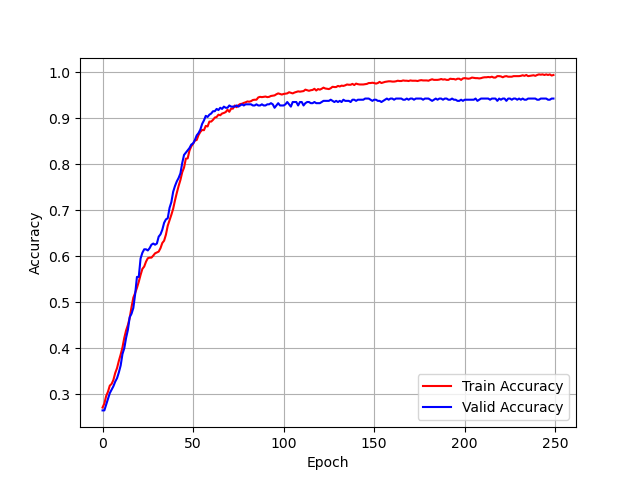

# Multi-Class-Classification-of-Mobile-Phones-Using-MLP
Multi-Class-Classification-of-Mobile-Phones-Using-MLP

### Output Plot Loss use CrossEntropyLoss

### Output Plot Accuracy use CrossEntropyLoss

